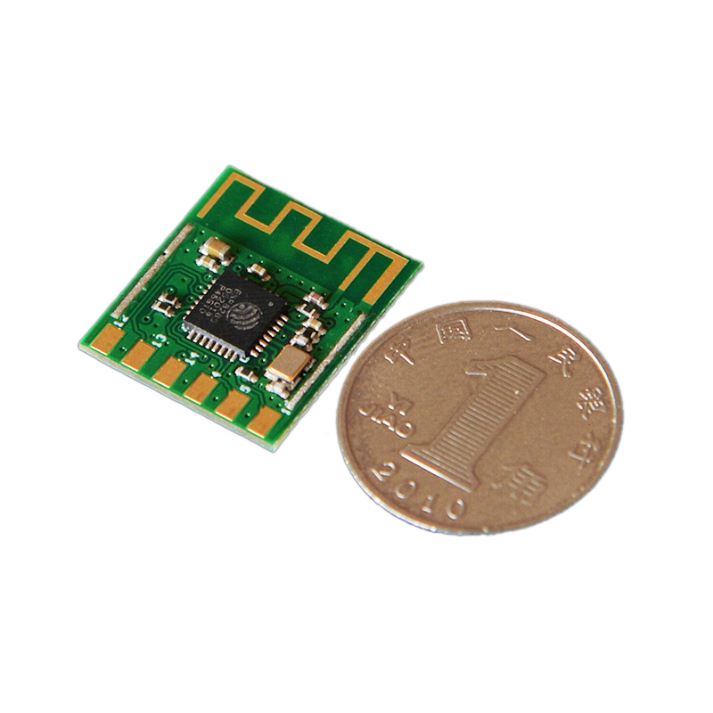
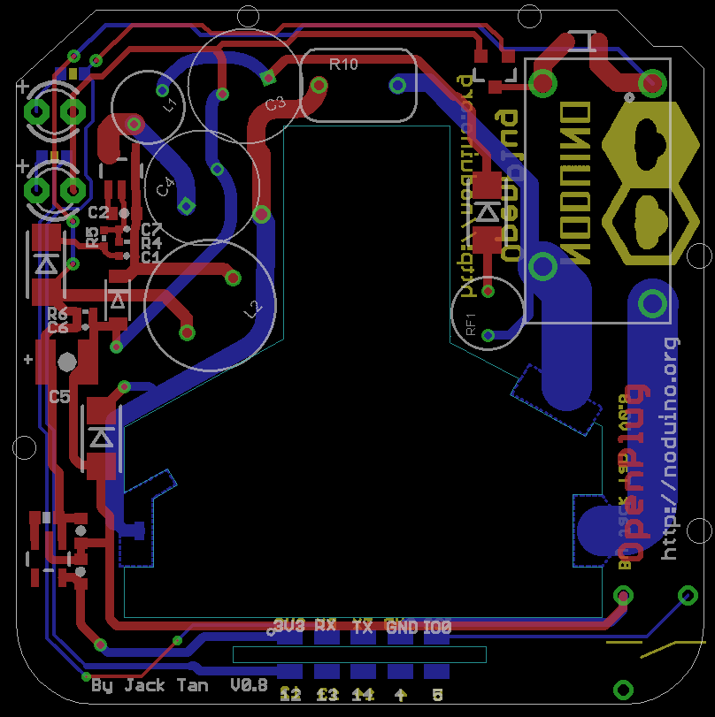

Noduino Open Plug
=======================================

[*Noduino Open Plug (OpenPlug V0.8)*](https://wiki.jackslab.org/Noduino_OpenPlug/)

[*Noduino Open Plug (OpenPlug V0.8)*](https://wiki.jackslab.org/Noduino_OpenPlug/)

Overview
-------------------

* AC 85V - 250V WiFi Smart Plug
* ESP8285 inside
* 250V 10A relay
* Shell size 53mm x 53mm x 27mm

Shell
-------------------

* https://detail.1688.com/offer/520959590805.html

WiFi Module
-------------------

[*Noduino NodeC WiFi Module*](https://wiki.jackslab.org/Noduino_SmartNode)

SCH
-------------------

[*Noduino Open Plug (OpenPlug V0.8)*](https://wiki.jackslab.org/Noduino_OpenPlug/)

Layout
-------------------

[*Noduino Open Plug (OpenPlug V0.8)*](https://wiki.jackslab.org/Noduino_OpenPlug/)

WiKi
-------------------

* http://wiki.jackslab.org/Noduino_OpenPlug

License Information
-------------------
The hardware is released under [Creative Commons ShareAlike 4.0 International](https://creativecommons.org/licenses/by-sa/4.0/).

Distributed as-is; no warranty is given.
